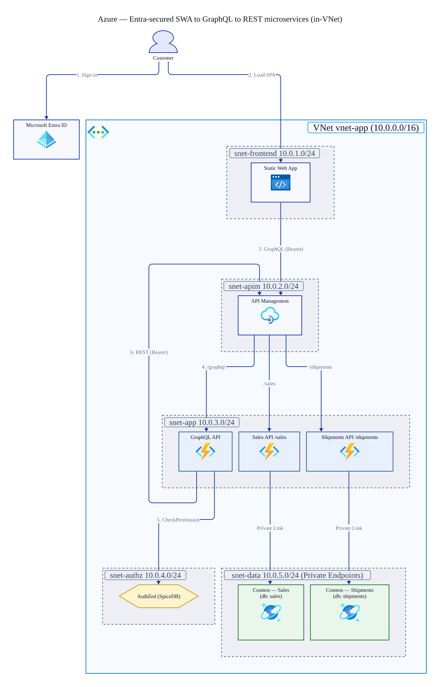
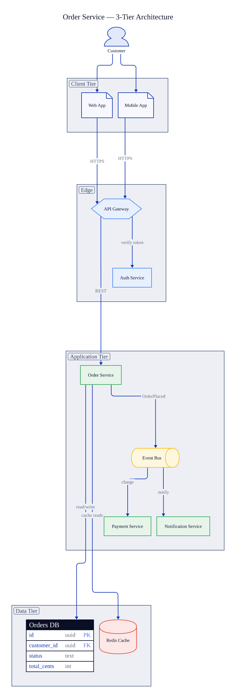

# my-dev-tools

## Agents

Tooling for AI coding agents.

### Skills

Portable [agent skills](https://agentskills.io). Each is a self-contained folder with a `SKILL.md` and supporting scripts that an agent can discover and run.

#### Installing

Install any skill with the [`gh skill`](https://cli.github.com/manual/gh_skill) command. Requires [GitHub CLI](https://cli.github.com) 2.90.0 or later (`gh skill` is in public preview).

Preview a skill before installing it:

```sh
gh skill preview colbytimm/my-dev-tools d2-diagram
```

##### GitHub Copilot, Cursor, Codex, Gemini CLI, Amp, Cline, OpenCode, Warp, Antigravity

At project scope these agents all read the shared `.agents/skills/` directory, so a single install covers all of them for the current repo:

```sh
# Project scope (this repo only) - installs to .agents/skills/
gh skill install colbytimm/my-dev-tools d2-diagram --agent github-copilot --scope project

# User scope (all repos, Copilot) - installs to ~/.copilot/skills/
gh skill install colbytimm/my-dev-tools d2-diagram --agent github-copilot --scope user
```

User-scope directories are per-agent. For a non-Copilot agent at user scope, pass its own `--agent` slug; running `gh skill install colbytimm/my-dev-tools` with no skill name opens an interactive picker that lists every supported agent.

##### Claude Code

Claude Code reads its own directories (`.claude/skills/` at project scope, `~/.claude/skills/` at user scope):

```sh
# Project scope (this repo only)
gh skill install colbytimm/my-dev-tools d2-diagram --agent claude-code --scope project

# User scope (all repos)
gh skill install colbytimm/my-dev-tools d2-diagram --agent claude-code --scope user
```

##### Pinning a version

Unpinned installs resolve to the latest tagged release, falling back to the default branch when no release exists (this repo has no tagged release yet). Pin to a git tag or commit SHA to stay put:

```sh
gh skill install colbytimm/my-dev-tools d2-diagram --pin <tag-or-commit-sha>
```

Pinned skills are skipped by `gh skill update`. To check for upstream changes across everything installed:

```sh
gh skill update --dry-run
```

#### Images & screenshots

##### [image-compose](agents/skills/image-compose/SKILL.md)

Combine multiple images (e.g. web screenshots) into a side-by-side, stacked, or grid layout for visual comparison. Adds optional per-panel title bars and emits a JSON manifest of panel positions for downstream annotation.

| Side-by-side with labels | Grid layout |
| --- | --- |
|  |  |

##### [image-annotate](agents/skills/image-annotate/SKILL.md)

Draw annotations on an image (boxes, ellipses, arrows, labeled connectors, callout bubbles, text, highlights, and blur/blackout redaction) from a JSON spec. Coordinates can be absolute or panel-relative via an image-compose manifest, and a `--caption` bar keeps page/source labels off the content.


**Used together**: `image-compose` lays out a comparison and emits a manifest; `image-annotate` reads that manifest to draw on each panel with `"panel": N`, so coordinates measured in the original screenshots map straight through. Here two calculations are composed, then boxed and connected to show which values match and which differ.


#### Diagrams

##### [d2-diagram](agents/skills/d2-diagram/SKILL.md)

Author software- and cloud-architecture diagrams as code with [d2](https://d2lang.com), render them to SVG/PNG/PDF, and embed them into markdown. Ships a lookup for the correct AWS/GCP/Azure service icons (whose hosted URLs are URL-encoded and impossible to guess), shared style/theme presets, and a renderer that degrades gracefully when raster export or the icon host is unavailable, falling back to SVG, or to remote icon references, instead of failing. Pure-stdlib scripts; requires the `d2` CLI.

| Cloud architecture (with provider icons) | Software architecture |
| --- | --- |
|  |  |

#### Azure Cosmos DB

##### [cosmosdb-datamodeling](agents/skills/cosmosdb-datamodeling/SKILL.md)

An interactive, requirements-driven workflow for designing an Azure Cosmos DB for NoSQL data model. It captures access patterns, decides embed-vs-reference and partition keys, applies scaling patterns (hierarchical/synthetic keys, write sharding, data binning, TTL), and produces two artifacts (a requirements scratchpad and a final data model) grounded in current Microsoft Learn guidance. Ships stdlib-only helper scripts for RU/cost estimation and for linting a model against documented service limits.

##### [cosmosdb-inspect](agents/skills/cosmosdb-inspect/SKILL.md)

Inspect a live Azure Cosmos DB for NoSQL account (read-only, via the Azure CLI) and emit an "observed model" plus optimization signals. It collects container configuration (partition keys, indexing, TTL, throughput) and Azure Monitor metrics (normalized RU consumption for hot-partition detection, 429 throttling, storage, document count), writing JSON in the same shape `cosmosdb-datamodeling` consumes. Requires `az` and `az login`; pure transform logic is unit-tested offline.

**Used together**: `cosmosdb-inspect` reverse-engineers a live account into an observed model and surfaces runtime signals (hot partitions, throttling, over-provisioning); `cosmosdb-datamodeling` lints that model against service limits, costs it, and drives a redesign. The two move you from "what does my account look like and where does it hurt" to "design and cost the fix."

#### Documentation

##### [readme-writer](agents/skills/readme-writer/SKILL.md)

Create or update README files that read like a maintainer wrote them. Encodes the structure of strong READMEs (lead with what it is, quick start early, demo with real output) plus a catalog of generated-sounding patterns to strip: marketing adjectives, AI vocabulary, emoji headers, rule-of-threes padding. Ships `lint_voice.mjs`, which runs markdownlint for mechanics and a set of custom markdownlint rules for voice (banned vocabulary, em dashes, summary openers, dead relative links).

##### [docs-writer](agents/skills/docs-writer/SKILL.md)

Write, update, or audit project documentation past the front page: tutorials, how-to guides, references, and explanation pages, each page written as exactly one of those four types. Inventories existing docs, diffs them against the code to catch stale commands and dead links, and proposes a page plan before writing. Adds docs-specific voice checks on top of the shared rules: condescension words, future-tense steps, second person.

**Used together**: `readme-writer` owns the repo front page; `docs-writer` covers everything past it. Both ship the same voice lint config (plain markdownlint rules), so a repo can adopt one setup in CI for all its markdown.

## License

MIT - see [LICENSE](LICENSE).
