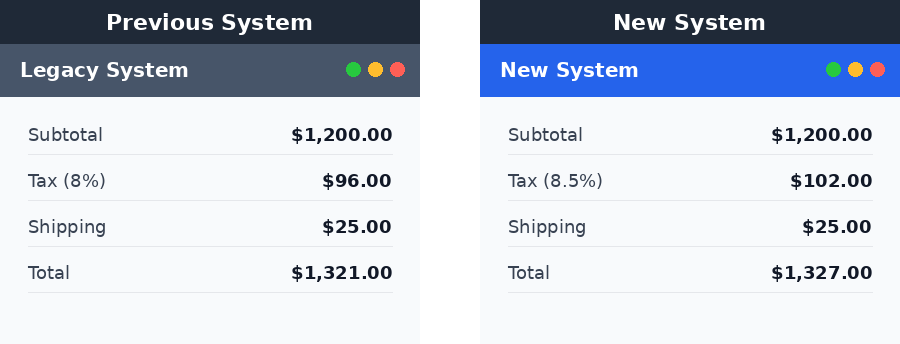
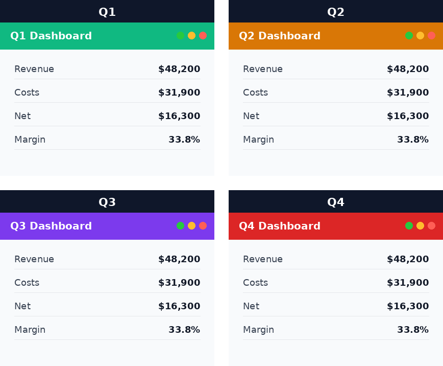
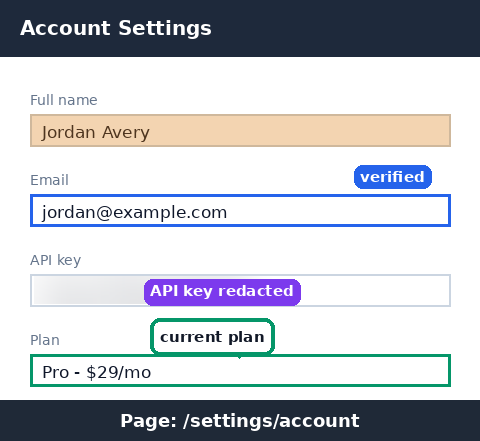
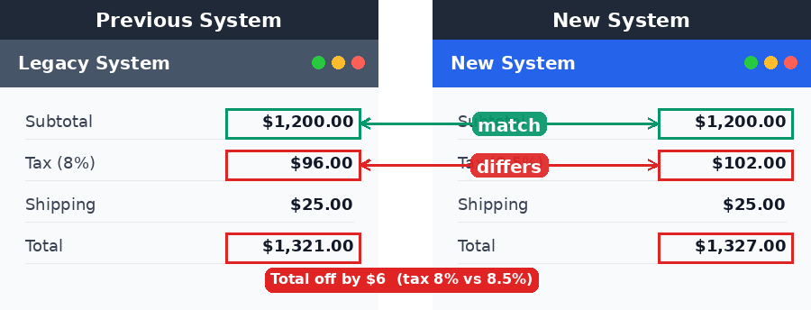

# my-dev-tools

## Agents

Tooling for AI coding agents.

### Skills

Portable [agent skills](https://agents.md) — each is a self-contained folder with a `SKILL.md` and supporting scripts that an agent can discover and run.

#### [image-compose](agents/skills/image-compose/SKILL.md)

Combine multiple images (e.g. web screenshots) into a side-by-side, stacked, or grid layout for visual comparison. Adds optional per-panel title bars and emits a JSON manifest of panel positions for downstream annotation.

| Side-by-side with labels | Grid layout |
| --- | --- |
|  |  |

#### [image-annotate](agents/skills/image-annotate/SKILL.md)

Draw annotations on an image (boxes, ellipses, arrows, labeled connectors, callout bubbles, text, highlights, and blur/blackout redaction) from a JSON spec. Coordinates can be absolute or panel-relative via an image-compose manifest, and a `--caption` bar keeps page/source labels off the content.

#### [d2-diagram](agents/skills/d2-diagram/SKILL.md)

Author software- and cloud-architecture diagrams as code with [d2](https://d2lang.com), render them to SVG/PNG/PDF, and embed them into markdown. Ships a lookup for the correct AWS/GCP/Azure service icons (whose hosted URLs are URL-encoded and impossible to guess) and a renderer that degrades gracefully when raster export or the icon host is unavailable — falling back to SVG, or to remote icon references, instead of failing. Pure-stdlib scripts; requires the `d2` CLI.

#### [cosmosdb-datamodeling](agents/skills/cosmosdb-datamodeling/SKILL.md)

An interactive, requirements-driven workflow for designing an Azure Cosmos DB for NoSQL data model. It captures access patterns, decides embed-vs-reference and partition keys, applies scaling patterns (hierarchical/synthetic keys, write sharding, data binning, TTL), and produces two artifacts — a requirements scratchpad and a final data model — grounded in current Microsoft Learn guidance. Ships stdlib-only helper scripts for RU/cost estimation and for linting a model against documented service limits.

#### [cosmosdb-inspect](agents/skills/cosmosdb-inspect/SKILL.md)

Inspect a live Azure Cosmos DB for NoSQL account (read-only, via the Azure CLI) and emit an "observed model" plus optimization signals. It collects container configuration (partition keys, indexing, TTL, throughput) and Azure Monitor metrics (normalized RU consumption for hot-partition detection, 429 throttling, storage, document count), writing JSON in the same shape `cosmosdb-datamodeling` consumes. Requires `az` and `az login`; pure transform logic is unit-tested offline.

#### Used together

`image-compose` lays out a comparison and emits a manifest; `image-annotate` reads that manifest to draw on each panel with `"panel": N` — coordinates measured in the original screenshots map straight through. Here two calculations are composed, then boxed and connected to show which values match and which differ.

`cosmosdb-inspect` reverse-engineers a live account into an observed model and surfaces runtime signals (hot partitions, throttling, over-provisioning); `cosmosdb-datamodeling` lints that model against service limits, costs it, and drives a redesign — so the two move you from "what does my account look like and where does it hurt" to "design and cost the fix."
