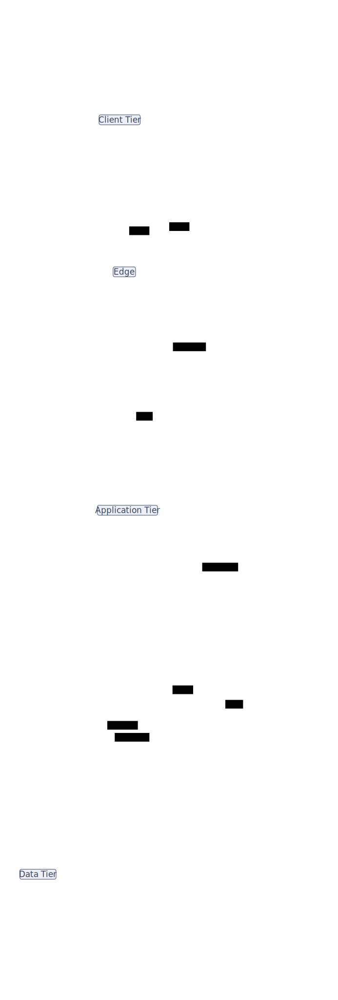

# Embedding a d2 diagram in markdown

Render a diagram and drop it into this file with `render.py --md`:

```bash
python ../scripts/render.py software-arch.d2 -o software-arch.svg \
  --md README-snippet.md --md-marker architecture
```

`render.py` inserts a marked block (below). Running the same command again
re-renders the SVG and replaces the image **in place** — the markers are how it
finds the block, so the doc never accumulates duplicates.

<!-- d2:architecture -->

<!-- /d2:architecture -->

Keep the `.d2` source committed alongside the markdown so the diagram can always
be regenerated.
